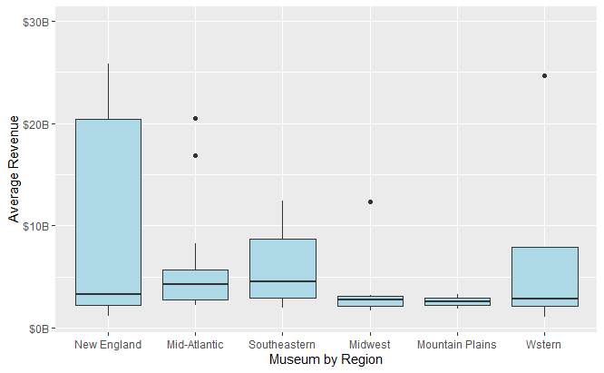

# Museum_analysis
Analysis of museum dataset in US. The data file includes basic information about each organization. 

Museum and Nature Center Dataset: https://www.kaggle.com/imls/museum-directory

Some basic Analysis and Graphs:

## Museums by Type

## Museum vs Non-museum

## Museum vs Non-museum by Several States

## Museum vs Non-museum by Geo Regions

## Museum Annual Revenue 

## Museum Income Annual Revenue by Region with Boxplot

